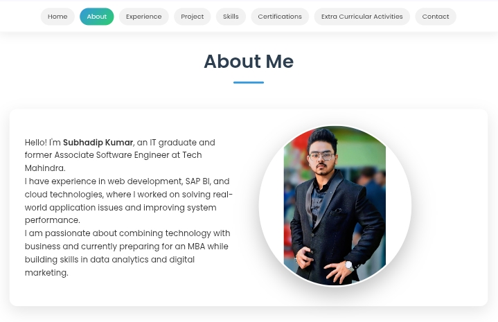
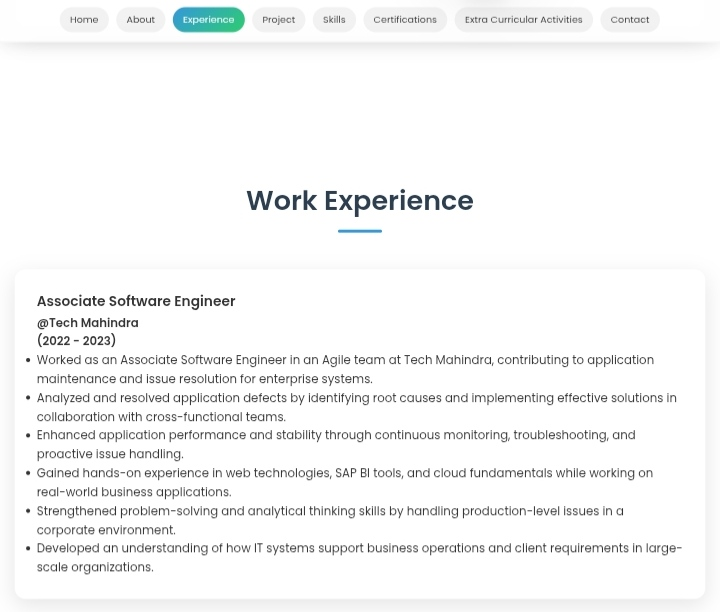
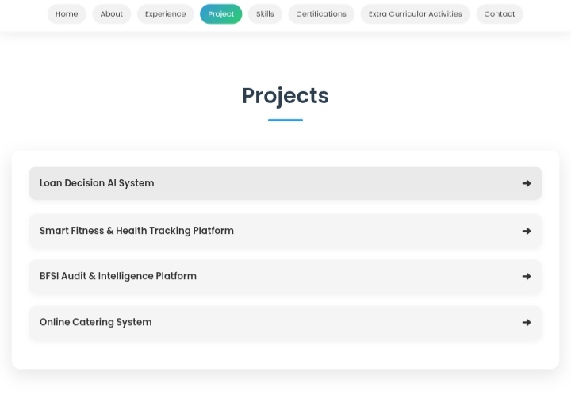
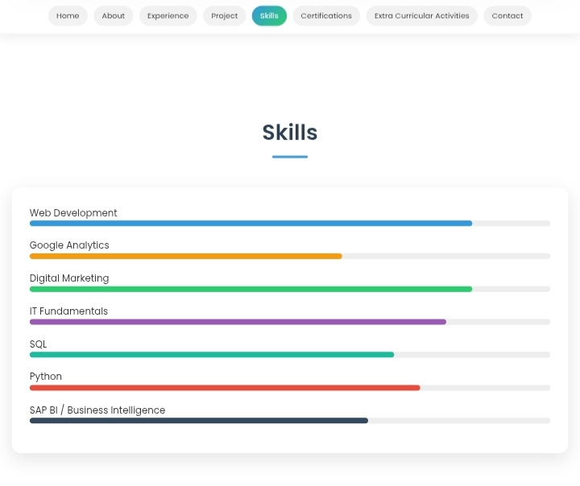
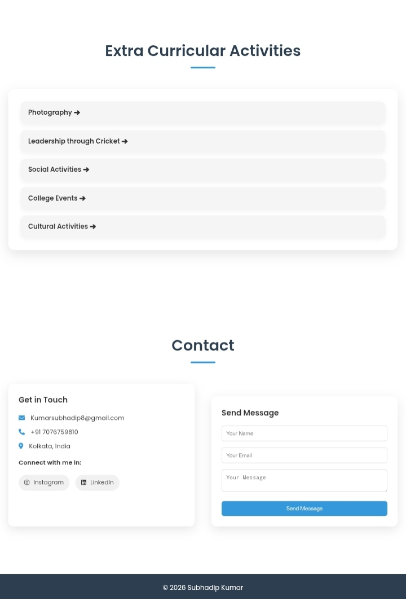
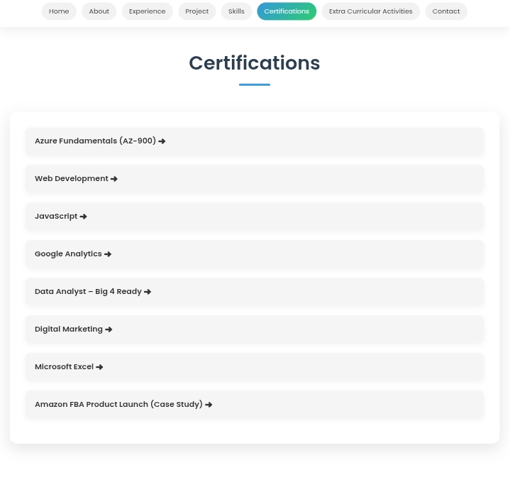

# 🚀 Personal Portfolio Website

A modern responsive developer portfolio website showcasing my background, technical skills, certifications, projects, and professional experience.

Designed with a clean UI/UX approach focused on simplicity, accessibility, and professional presentation.

---

# 🌐 Live Demo

🔗 https://iamdip-sk10.github.io/subhadip-portfolio/

---

# 📸 Website Preview

## 🏠 Homepage


---

## 👨‍💻 About Section


---

## 💼 Experience Section


---

## 🚀 Projects Section


---

## 🛠 Skills Section


---

## 📬 Contact Section


---

## 📜 Certifications


---

# ✨ Features

- Modern responsive UI
- Mobile-first design
- Smooth scrolling navigation
- Animated sections
- Interactive project showcase
- Skills visualization
- Professional clean layout
- Lightweight and fast performance

---

# 🛠 Tech Stack

- HTML5
- CSS3
- JavaScript
- Responsive Design
- Custom CSS Animations

---

# 📱 Responsive Design

Optimized for:
- Desktop
- Tablet
- Mobile devices

---

# 👨‍💻 About Me

BTech IT graduate passionate about:
- Web Development
- BFSI Technology
- AI & Digital Innovation
- UI/UX Design
- Strategy & Analytics

---

# 🚀 Projects Included

- FinWithDip — BFSI Intelligence Platform
- Personal Portfolio Website
- Upcoming AI & FinTech Projects

---

# 🔮 Future Improvements

- Dark/Light mode toggle
- Backend contact form integration
- Resume download feature
- Advanced animations
- Project filtering system
- Blog section

---

# 📄 License

This project is created for educational, portfolio, and professional branding purposes.

---

# ⭐ Support

If you like this project, consider starring the repository.

```bash
git clone https://github.com/iamdip-sk10/subhadip-portfolio.git
```
